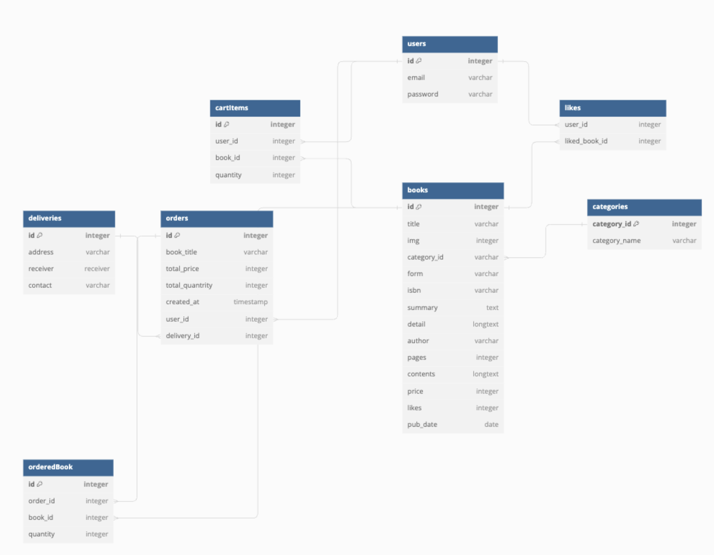

## ERD

 

## 구현 완료 사항

- [x] 타입스크립트 전환
- [x] route - service - controller 구조

 

## 추가 구현 사항

- [ ] API Response 포맷 정돈 (status code, naming convention, camel case)
- [ ] bcrypt로 보안 강화
- [ ] 유효성 체크 (express-validator)
- [ ] 에러 미들웨어로 별도 처리
- [ ] access token, referesh token 발급
- [ ] swagger 연동
- [ ] ORM 적용 (sequelize OR TypeORM)
- [ ] 도서 랜덤 데이터 추가

 

## Naming Convention

라우터 - 서비스 - 컨트롤러 계층 구조에 속하는 파일은 <code>[모델 이름].[계층].ts</code>로 통일한다.

타입 정의에 속하는 파일은 <code>[모델 이름].[models].ts</code>로 통일한다.

#### controllers

각 핸들러에 사용된 method를 기반으로 수행할 기능을 명시한다.

POST의 경우 데이터 생성이라고 보기에는 애매하다고 판단하여 create로 통일 혹은 상황에 맞게 처리한다.

#### services

서비스 함수는 각 함수가 DB에 요청하는 작업을 기반으로 작업을 요청한 테이블을 명시한다.

요청 작업 중 select는 무언가를 찾는 요청과는 거리가 있다고 판단하여 좀 더 명확한 find로 통일한다.
